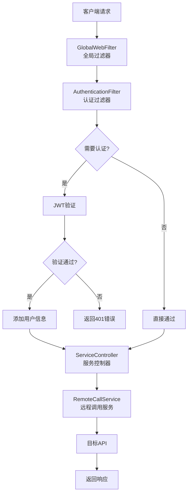
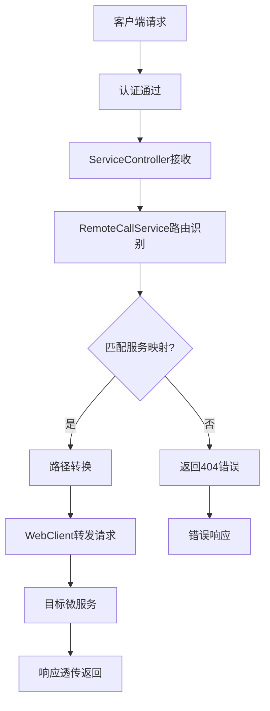

# 📋 OpenAPI Service 项目文档

## 🚀 项目概述

OpenAPI Service是一个基于Spring Boot WebFlux的反应式微服务项目，提供JWT Token认证、API网关代理、请求日志记录等核心功能。项目采用现代化的技术栈，具备高并发、低延迟的特性。

### 🎯 核心特性

| 特性 | 描述 | 状态 |
|------|------|------|
| 🔐 **JWT认证** | 基于JWT的Token生成与验证机制 | ✅ 已实现 |
| 🛡️ **认证拦截器** | 全链路请求认证与授权控制 | ✅ 已实现 |
| 📊 **请求日志** | 完整的请求响应日志记录系统 | ✅ 已实现 |
| 🌐 **API网关** | 请求代理与转发功能 | ✅ 已实现 |
| 💾 **MySQL集成** | 持久化存储应用凭证管理 | ✅ 已实现 |
| 🚀 **响应式编程** | 基于WebFlux的非阻塞IO | ✅ 已实现 |

---

## 📊 技术架构

### 🛠️ **技术栈配置**

```yaml
框架版本信息：
┌─────────────────────────────────────────────────────────┐
│ Spring Boot      │ 2.7.14                              │
│ Spring WebFlux   │ 响应式Web框架                        │
│ JWT              │ 0.11.5 (io.jsonwebtoken)           │
│ MySQL Connector  │ 8.0.33                             │
│ JPA/Hibernate    │ 数据持久化                           │
│ Java Version     │ 1.8                                │
│ Maven           │ 构建工具                             │
└─────────────────────────────────────────────────────────┘
```

### 🏗️ **系统架构图**



---

## 📁 项目结构

### 📂 **目录结构详解**

```
openapi-service/
├── src/main/
│   ├── java/org/openapi/
│   │   ├── 📂 common/          # 公共组件
│   │   │   ├── BaseResponse.java      # 统一响应格式
│   │   │   └── ConstantsHub.java      # 常量定义
│   │   ├── 📂 config/          # 配置类
│   │   │   └── WebFluxConfig.java     # WebFlux配置
│   │   ├── 📂 controller/      # 控制器层
│   │   │   ├── AuthController.java    # 认证接口
│   │   │   ├── HelloServiceController.java  # 测试接口
│   │   │   └── ServiceController.java # 主服务接口
│   │   ├── 📂 dto/             # 数据传输对象
│   │   │   ├── AuthRequest.java       # 认证请求DTO
│   │   │   └── AuthResponse.java      # 认证响应DTO
│   │   ├── 📂 entity/          # 实体类
│   │   │   └── AppCredentials.java    # 应用凭证实体
│   │   ├── 📂 filter/          # 过滤器
│   │   │   ├── AuthenticationFilter.java  # 认证拦截器
│   │   │   └── GlobalWebFilter.java   # 全局过滤器
│   │   ├── 📂 repository/      # 数据访问层
│   │   │   └── AppCredentialsRepository.java
│   │   ├── 📂 service/         # 业务逻辑层
│   │   │   ├── AppService.java        # 应用管理服务
│   │   │   ├── JwtService.java        # JWT工具服务
│   │   │   └── RemoteCallService.java # 远程调用服务
│   │   └── Application.java    # 启动类
│   └── resources/
│       ├── application.yml     # 应用配置
│       ├── data.sql           # 数据库初始化脚本
│       └── logging-config.xml # 日志配置
├── README.md                  # 基础说明文档
├── JWT_API_使用说明.md        # JWT API使用指南
└── pom.xml                    # Maven配置
```

---

## 🔐 认证系统

### 🎯 **JWT Token管理**

#### 📋 **Token生成流程**

```java
Token生成机制：
┌─────────────────────────────────────────────────────────┐
│ 1. 客户端提供 appId + appSecret                         │
│ 2. 数据库验证凭证有效性                                  │
│ 3. 生成JWT Token (HMAC-SHA256)                        │
│ 4. 设置7天有效期 (604800秒)                            │
│ 5. 返回完整认证信息                                      │
└─────────────────────────────────────────────────────────┘
```

#### 🔑 **JWT配置参数**

| 参数 | 默认值 | 描述 |
|------|--------|------|
| `jwt.secret` | 系统默认密钥 | JWT签名密钥(生产环境需修改) |
| `jwt.expiration` | `604800` | Token有效期(7天) |
| `jwt.issuer` | `openapi-service` | Token签发者标识 |

### 🛡️ **认证拦截器机制**

#### 📊 **过滤器执行链**

```java
过滤器执行顺序：
┌─────────────────────────────────────────────────────────┐
│ Order: -1  │ GlobalWebFilter     │ 全局日志+跨域处理   │
│ Order: 0   │ AuthenticationFilter│ JWT认证检查        │
└─────────────────────────────────────────────────────────┘
```

#### 🔍 **认证策略**

- **保护路径**: 除 `/auth/**`（获取token接口） 和 `/api/v1/**`（服务自身监控检查接口） 外的所有路径
- **认证方式**: Bearer Token (JWT)
- **失败处理**: 返回401状态码与错误信息
- **用户注入**: 成功认证后注入用户信息到请求头

---

## 📡 API接口详解

### 🔐 **认证相关接口**

#### 1. **生成JWT Token**

```http
POST /auth/token
Content-Type: application/json

{
    "appId": "test-app-001",
    "appSecret": "test-secret-001-abcdef123456789"
}
```

**响应格式:**
```json
{
    "result": true,
    "errorMsg": "Token生成成功",
    "data": {
        "token": "eyJhbGciOiJIUzI1NiIsInR5cCI6IkpXVCJ9...",
        "tokenType": "Bearer",
        "expiresIn": 604800,
        "issuedAt": "2025-09-20T15:55:00",
        "expiresAt": "2025-09-27T15:55:00",
        "appId": "test-app-001",
        "appName": "测试应用"
    }
}
```

#### 2. **验证JWT Token**

```http
POST /auth/validate?token={JWT_TOKEN}
```

**响应格式:**
```json
{
    "result": true,
    "errorMsg": "Token验证成功",
    "data": {
        "valid": true,
        "appId": "test-app-001",
        "appName": "测试应用",
        "remainingTime": 604800,
        "nearExpiry": false,
        "validatedAt": "2025-09-20T15:56:00"
    }
}
```

### 🌐 **API代理接口**

#### **通用API代理**

```http
GET|POST|PUT|DELETE /api/**
Headers:
  Authorization: Bearer {JWT_TOKEN}
```

- **功能**: 将请求代理转发到后端服务
- **认证**: 必须提供有效的JWT Token
- **错误处理**: 统一的错误响应格式

---

## 🌐 服务发现与路由系统

### 🎯 **核心功能**

OpenAPI Service 实现了完整的服务发现和智能路由转发机制，支持微服务架构下的动态服务调用。

#### 📊 **服务发现机制**

| 功能 | 实现方式 | 特点 |
|------|----------|------|
| 🔄 **定时发现** | ScheduledExecutorService每10分钟更新 | 自动化服务列表维护 |
| 📋 **服务映射** | ConcurrentHashMap存储路径-地址映射 | 高并发安全访问 |
| 🛡️ **异常保护** | Try-catch机制保护主流程 | 发现失败不影响服务 |
| 🔧 **扩展支持** | 预留注册中心集成接口 | 支持Eureka/Nacos对接 |

#### 🗺️ **路由转发流程**



---

## 💾 数据库设计

### 📊 **应用凭证表结构**

```sql
CREATE TABLE app_credentials (
    id BIGINT AUTO_INCREMENT PRIMARY KEY,
    app_id VARCHAR(32) NOT NULL UNIQUE,
    app_secret VARCHAR(64) NOT NULL,
    app_name VARCHAR(100),
    description VARCHAR(500),
    status INT DEFAULT 1,  -- 1:启用, 0:禁用
    created_time TIMESTAMP DEFAULT CURRENT_TIMESTAMP,
    updated_time TIMESTAMP DEFAULT CURRENT_TIMESTAMP ON UPDATE CURRENT_TIMESTAMP
);
```

### 🔑 **预置测试数据（示例）**

| AppId | AppSecret | AppName | 状态 |
|-------|-----------|---------|------|
| `test-app-001` | `test-secret-001-abcdef123456789` | 测试应用 | 启用 |
| `demo-app-002` | `demo-secret-002-xyz987654321abc` | 演示应用 | 启用 |
| `prod-app-003` | `prod-secret-003-secure-long-key` | 生产应用 | 启用 |

---

## ⚙️ 配置管理

### 📝 **application.yml核心配置**

```yaml
# 服务基本配置
server:
  port: 9911
  max-http-header-size: 10485760

spring:
  application:
    name: demo-Y-hello-service
  
  # MySQL数据库配置
  datasource:
    url: jdbc:mysql://192.168.0.xxx:3306/xxxxxxxxxx?useUnicode=true&characterEncoding=utf8&useSSL=false&serverTimezone=Asia/Shanghai&allowMultiQueries=true
    driver-class-name: com.mysql.cj.jdbc.Driver
    username: xxxxxxx
    password: xxxxxxx
    
    # HikariCP连接池配置
    hikari:
      minimum-idle: 5
      maximum-pool-size: 20
      auto-commit: true
      idle-timeout: 30000
      pool-name: OpenApiHikariCP
      max-lifetime: 1800000
      connection-timeout: 30000
      connection-test-query: SELECT 1
  
  # JPA配置
  jpa:
    database-platform: org.hibernate.dialect.MySQL8Dialect
    hibernate:
      ddl-auto: none
    show-sql: false
    properties:
      hibernate:
        format_sql: true
        dialect: org.hibernate.dialect.MySQL8Dialect
        jdbc:
          time_zone: Asia/Shanghai

# 日志配置
logging:
  config: classpath:logging-config.xml
```

### 📝 **服务映射配置说明**

```json
{
    "/api/service-a/**": "http://localhost:8081",
    "/api/service-b/**": "http://localhost:8082", 
    "/api/service-c/**": "http://localhost:8083",
    "/api/user-service/**": "http://192.168.1.100:8080",
    "/api/order-service/**": "http://192.168.1.101:8080"
}
```

---

## 🧪 测试指南

### 🚀 **快速启动**

```bash
# 1. 确保MySQL数据库运行
# 2. 创建数据库(如果不存在)
CREATE DATABASE app_credentials;

# 3. 启动应用
mvn spring-boot:run -Dspring.profiles.active=loc

# 4. 验证服务状态
curl http://localhost:9911/api/v1/healthcheck
```

### 📊 **API测试用例**

#### **测试Token生成**

```bash
curl -X POST http://localhost:9911/auth/token \
  -H "Content-Type: application/json" \
  -d '{
    "appId": "test-app-001",
    "appSecret": "test-secret-001-abcdef123456789"
  }'
```

#### **测试认证接口**

```bash
# 使用生成的Token测试
curl -X GET http://localhost:9911/api/service-a/v1/users \
  -H "Authorization: Bearer YOUR_JWT_TOKEN"
```

#### **测试Token验证**

```bash
curl -X POST "http://localhost:9911/auth/validate?token=YOUR_JWT_TOKEN"
```

---

## 📈 性能与监控

### 📊 **性能指标**

```yaml
预期性能指标：
┌─────────────────────────────────────────┐
│ Token生成     │ 平均响应时间: 5-15ms    │
│ Token验证     │ 平均响应时间: 2-8ms     │
│ API代理       │ 平均响应时间: 10-50ms   │
│ 数据库查询    │ 平均响应时间: 1-5ms     │
│ 并发支持      │ 理论支持: 1000+ TPS     │
└─────────────────────────────────────────┘
```

### 📝 **日志系统**

#### **日志级别配置**

- **INFO**: 正常业务流程记录
- **WARN**: 认证失败、异常状况
- **ERROR**: 系统错误、异常堆栈
- **DEBUG**: 调试信息(Token解析等)

#### **日志格式示例**

```log
# 请求开始
2025-09-20 15:10:15 request came [2025-09-20 15:10:15][req-123] GET /api/service-a/v1/users from 127.0.0.1

# 认证成功
2025-09-20 15:10:15 [req-123]认证成功 - Path: /api/service-a/v1/users

# 请求完成
2025-09-20 15:10:15 request done [2025-09-20 15:10:15][req-123] GET /api/service-a/v1/users - Status: 200 OK - Duration: 45ms
```

---

## 🛡️ 安全防护

### 🔐 **安全机制**

```yaml
安全保障措施：
┌─────────────────────────────────────────────────────────┐
│ 🔒 JWT签名    │ HMAC-SHA256算法，密钥长度≥32字符      │
│ ⏰ Token时效  │ 7天有效期，防止长期滥用               │
│ 🔍 请求验证   │ 签名验证、过期检查、格式校验           │
│ 📊 凭证管控   │ 数据库存储，支持启用/禁用状态          │
│ 🛡️ 跨域保护   │ CORS配置，支持预检请求               │
│ 📝 日志审计   │ 完整的认证日志记录系统               │
└─────────────────────────────────────────────────────────┘
```

### ⚠️ **安全建议**

1. **🔑 生产环境密钥**: 必须修改默认JWT密钥
2. **💾 数据库安全**: 使用强密码，限制数据库访问
3. **🌐 HTTPS部署**: 生产环境必须使用HTTPS
4. **📊 监控告警**: 建立异常认证监控机制
5. **🔄 密钥轮换**: 定期更新JWT签名密钥

---

## 🚀 部署指南

### 🏗️ **生产部署建议**

#### **环境要求**

```yaml
生产环境配置：
┌─────────────────────────────────────────┐
│ Java Version  │ 1.8+                   │
│ Memory        │ 最小2GB，推荐4GB+       │
│ CPU           │ 最小2核，推荐4核+       │
│ MySQL         │ 5.7+ 或 8.0+          │
│ Network       │ 千兆网络               │
└─────────────────────────────────────────┘
```

#### **部署步骤**

```bash
# 1. 构建应用
mvn clean package -DskipTests

# 2. 配置生产环境变量
export JWT_SECRET="your-super-secure-jwt-secret-key-for-production"
export DB_URL="jdbc:mysql://prod-db:3306/openapi_service"
export DB_USERNAME="openapi_user"
export DB_PASSWORD="secure_password"

# 3. 启动应用
java -jar -Xms2g -Xmx4g -Dspring.profiles.active=prod target/service-0.0.1-SNAPSHOT.jar
```

### 📊 **监控配置**

```yaml
# 添加到application.yml
management:
  endpoints:
    web:
      exposure:
        include: health,info,metrics,prometheus
  endpoint:
    health:
      show-details: always
```

---

## 🔧 开发指南

### 💡 **扩展功能建议**

1. **🔄 Token刷新**: 实现Token自动刷新机制
2. **👥 用户管理**: 添加用户CRUD管理接口
3. **📊 API统计**: 增加API调用统计功能
4. **🚦 限流控制**: 实现请求频率限制
5. **🔍 链路追踪**: 集成分布式链路追踪

### 🎯 **代码规范**

- **📝 注释**: 所有公共方法必须有JavaDoc注释
- **🔧 异常处理**: 统一的异常处理机制
- **📊 日志规范**: 使用结构化日志格式
- **🧪 单元测试**: 核心业务逻辑必须有单元测试

---

## 📞 联系信息

### 🛠️ **维护团队**

- **项目负责人**: OpenAPI Team
- **技术栈**: Spring Boot + WebFlux + JWT + MySQL
- **更新频率**: 持续集成与部署

### 📚 **相关文档**

- `README.md`: 基础说明文档

---

## 📋 版本记录

| 版本 | 日期 | 更新内容 |
|------|------|----------|
| v0.0.1 | 2025-09-14 | 初始版本，基础JWT认证功能 |
| v0.0.2 | 2025-09-17 | 完善认证拦截器，增加MySQL支持 |
| v0.0.3 | 2025-09-20 | 优化日志系统，完善API文档 |

---

**🎉 感谢使用 OpenAPI Service！**

*如有问题，请参考相关文档或联系开发团队。*
